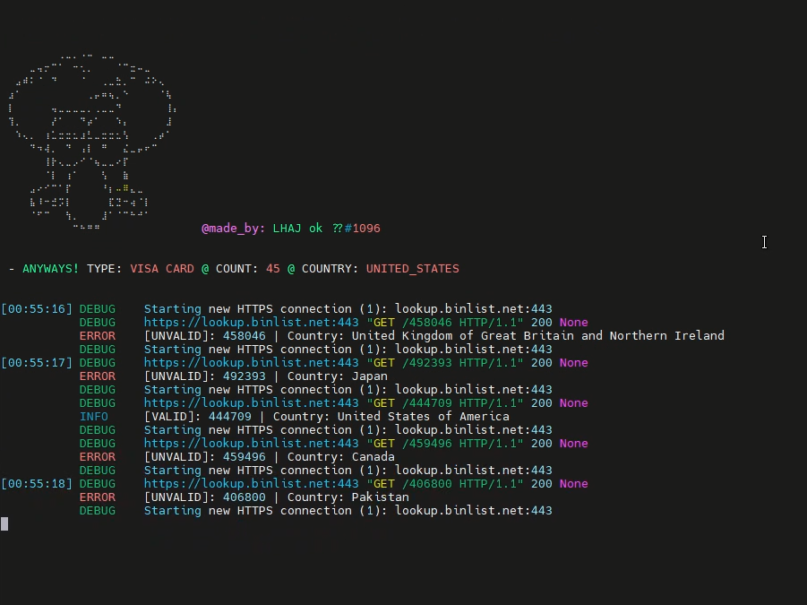

# BIN GENERATOR / LOOKUP 

<br>
<br>

 _LHAJ is back again with another sh1tposting XD_ 
<br>


### **ShowCase:**
[](https://www.youtube.com/watch?v=rmMkRoy4ldk)


### **Usage:**
<br>

<br>
<br>

**e.g:**
```sh
python bingen.py --type VISA --count 40 --country RANDOM
```

<br>

##### **Params:**
<br>

- _type_: ```--type```
<br>
    1. VISA ```--type VISA```
    2. MASTER ```--type MASTER```
    - **NOTE**: AMERICAN EXPRESS , DISCOVER ... aren't supported yet ! add them if you want
<br>
<br>

- _count_: ```--count```
<br>
    1. generate 30 bin"s: ```--count 30```
    2. generate 45 bin"s: ```--count 45```
    3. generate 99 bin"s: ```--count 99```
<br>
<br>

- _country_: ```--country```
<br>

    1. turkey bin: ```--country TURKEY``
    2. canada bin: ```--country CANADA```
    3. poland bin: ```--country POLAND````

    - u just switch to **upper case**
    - here"s a (_json_) country list below
<br>
<br>

##### **Installation:**
<br>

+ FOR **_WINDOWS USERS_:**
    - just run setup.bat ```C:\Users\LHAJ> setup.bat```
    - for windows i highly recommend to change the cmd font to something like "cascadia mono" !

<br>

+ FOR **_WINDOWS USERS_:**
    - same thing just run the .sh file ```$>/setup.sh ```

<br>

##### **Notes:**
<br>

- **NOTE**: u can check countries using ```--country_list```
- **NOTE**: all params above are required except country which is _USA_ by default
<br>
<br>

##### **Countries:**
<br>

<br>
<br>

```json
{
    "Random": "RANDOM",
    "Albania": "ALBANIA",
    "Algeria": "ALGERIA",
    "Argentina": "ARGENTINA",
    "Armenia": "ARMENIA",
    "Australia": "AUSTRALIA",
    "Austria": "AUSTRIA",
    "Azerbaijan": "AZERBAIJAN",
    "Bahamas": "BAHAMAS",
    "Bahrain": "BAHRAIN",
    "Bangladesh": "BANGLADESH",
    "Barbados": "BARBADOS",
    "Belarus": "BELARUS",
    "Belgium": "BELGIUM",
    "Bolivia": "BOLIVIA",
    "Botswana": "BOTSWANA",
    "Brazil": "BRAZIL",
    "Brunei": "BRUNEI",
    "Cambodia": "CAMBODIA",
    "Cameroun": "CAMEROUN",
    "Canada": "CANADA",
    "Cayman Islands": "CAYMAN_ISLANDS",
    "Chile": "CHILE",
    "China": "CHINA",
    "Colombia": "COLOMBIA",
    "Costa Rica": "COSTA_RICA",
    "Croatia": "CROATIA",
    "Cuba": "CUBA",
    "Cyprus": "CYPRUS",
    "Denmark": "DENMARK",
    "Dominican Republic": "DOMINICAN_REPUBLIC",
    "DR Congo": "DR_CONGO",
    "Ecuador": "ECUADOR",
    "Egypt": "EGYPT",
    "El Salvador": "EL_SALVADOR",
    "Emirates": "EMIRATES",
    "Estonia": "ESTONIA",
    "Ethiopia": "ETHIOPIA",
    "Fiji": "FIJI",
    "Finland": "FINLAND",
    "France": "FRANCE",
    "Germany": "GERMANY",
    "Ghana": "GHANA",
    "Guatemala": "GUATEMALA",
    "Honduras": "HONDURAS",
    "Hong Kong": "HONG_KONG",
    "Hungary": "HUNGARY",
    "India": "INDIA",
    "Indonesia": "INDONESIA",
    "Iran": "IRAN",
    "Ireland": "IRELAND",
    "Israel": "ISRAEL",
    "Italy": "ITALY",
    "Ivory Coast": "IVORY_COAST",
    "Jamaica": "JAMAICA",
    "Japan": "JAPAN",
    "Jordan": "JORDAN",
    "Kazakhstan": "KAZAKHSTAN",
    "Kenya": "KENYA",
    "Korea": "KOREA",
    "Kuwait": "KUWAIT",
    "Latvia": "LATVIA",
    "Lebanon": "LEBANON",
    "Lesotho": "LESOTHO",
    "Libya": "LIBYA",
    "Lithuania": "LITHUANIA",
    "Luxembourg": "LUXEMBOURG",
    "Madagascar": "MADAGASCAR",
    "Malawi": "MALAWI",
    "Malaysia": "MALAYSIA",
    "Mali": "MALI",
    "Malta": "MALTA",
    "Mauritius": "MAURITIUS",
    "Mexico": "MEXICO",
    "Moldova": "MOLDOVA",
    "Morocco": "MOROCCO",
    "Myanmar": "MYANMAR",
    "Namibia": "NAMIBIA",
    "Nepal": "NEPAL",
    "Netherlands": "NETHERLANDS",
    "New Zealand": "NEW_ZEALAND",
    "Nicaragua": "NICARAGUA",
    "Nigeria": "NIGERIA",
    "Norway": "NORWAY",
    "Oman": "OMAN",
    "Pakistan": "PAKISTAN",
    "Panama": "PANAMA",
    "Papua New Guinea": "PAPUA_NEW_GUINEA",
    "Paraguay": "PARAGUAY",
    "Peru": "PERU",
    "Philippines": "PHILIPPINES",
    "Poland": "POLAND",
    "Portuguese": "PORTUGUESE",
    "Puerto Rico": "PUERTO_RICO",
    "Qatar": "QATAR",
    "Romania": "ROMANIA",
    "Russia": "RUSSIA",
    "Rwanda": "RWANDA",
    "Saudi Arabia": "SAUDI_ARABIA",
    "Senegal": "SENEGAL",
    "Singapore": "SINGAPORE",
    "Slovakia": "SLOVAKIA",
    "Slovenia": "SLOVENIA",
    "South Africa": "SOUTH_AFRICA",
    "Spain": "SPAIN",
    "Sri Lanka": "SRI_LANKA",
    "Suriname": "SURINAME",
    "Sweden": "SWEDEN",
    "Switzerland": "SWITZERLAND",
    "Taiwan(China)": "TAIWAN(CHINA)",
    "Tanzania": "TANZANIA",
    "Thailand": "THAILAND",
    "The Czech Republic": "THE_CZECH_REPUBLIC",
    "The Republic of Iceland": "THE_REPUBLIC_OF_ICELAND",
    "Trinidad and Tobago": "TRINIDAD_AND_TOBAGO",
    "Tunisia": "TUNISIA",
    "Turkey": "TURKEY",
    "Uganda": "UGANDA",
    "Ukraine": "UKRAINE",
    "United Kingdom": "UNITED_KINGDOM",
    "United States": "UNITED_STATES",
    "Uruguay": "URUGUAY",
    "Uzbekistan": "UZBEKISTAN",
    "Venezuela": "VENEZUELA",
    "Vietnam": "VIETNAM",
    "Yemen": "YEMEN",
    "Zambia": "ZAMBIA",
    "Zimbabwe": "ZIMBABWE",
}
```
<br>

* **NOTICE** that there is a "RANDOM" key, value up there which means u can generate random one too as i mentioned in the _PARAMS_ part just use ```--country RANDOM```

* **WHAT's NEXT ??** build something that reads json output and show it in a format crackheads can understand ~ehe ...

<br>
<br>

##### **DISCLAIMER:**


<br>

<br>
<br>

- so as u can see in this little project i tried to implement what i/we (u may learned something) learned about web requests which means that this is just for educational purposes
- however dont spam cc's or any kind of harm, i just wanna say IM NOT RESPONSIBLE FOR U'RE USAGE OF THIS AND HOW YOUR BRAIN REACT's OR TAKES ACTIONS ahm... :3
